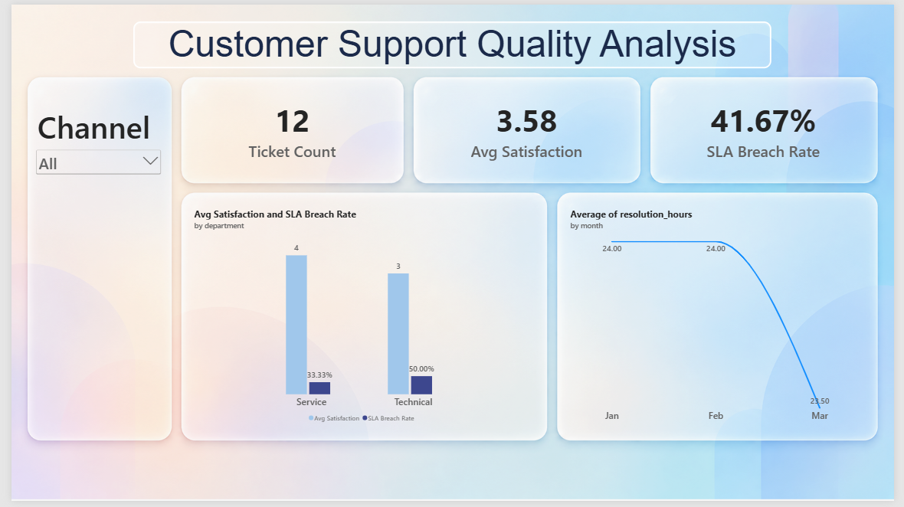

<div align="center">

# 📊 Data Analysis Practical — Set A

**Customer Support Ticket Analysis using Excel · SQL · Python · Power BI**


### 🎥 [▶️ Watch Video Walkthrough (12 min)](https://drive.google.com/file/d/1ERo3CWiQKdN4bZhw-_GyeAoQ93tTGwUe/view?usp=drive_link)

</div>

---

## 🖼️ Power BI Dashboard

<div align="center">



</div>

---

## 👤 Student Details

| Field | Details |
|---|---|
| **Name** | Mayur Makwana |
| **Student ID** | 11391 |
| **Set** | Set A |

---

## 📌 Table of Contents

1. [Objective](#1-objective)
2. [Business Questions](#2-business-questions)
3. [Dataset](#3-dataset)
4. [Cleaning & Metrics](#4-cleaning--metrics)
5. [Tools Used](#5-tools-used)
6. [Project Structure](#6-project-structure)
7. [Setup & Run](#7-setup--run)
8. [Findings](#8-findings)
9. [Cross-tool Reconciliation](#9-cross-tool-reconciliation)
10. [Video Walkthrough](#10-video-walkthrough)
11. [Authorship](#11-authorship)

---

## 1. Objective

Analyze the given support ticket data, remove duplicate records, calculate the required metrics, and answer the business questions using **Excel, SQL, Python and Power BI**.

## 2. Business Questions

1. ❓ Which support team should improve its resolution performance?
2. ❓ How does service quality vary by channel?

## 3. Dataset

| File | Type | Description |
|---|---|---|
| `data/raw/tickets.csv` | Fact data | Individual support tickets |
| `data/raw/teams.csv` | Lookup data | Team details |

> 🧹 Duplicate records were removed, leaving **12 clean records**.

## 4. Cleaning & Metrics

**Cleaning steps**
- Removed the exact duplicate row.
- Joined both tables using `team_id`.

**Metrics**

| Metric | Definition |
|---|---|
| `breach_flag` | `resolution_hours > 24` |
| `breach_rate` | `breach_flag_count / total records × 100` |

## 5. Tools Used

| Tool | Purpose |
|---|---|
| 📗 **Excel** | Pivot analysis |
| 🐬 **MySQL 8.0** | Setup and queries |
| 🐍 **Python** (pandas, matplotlib) | Analysis and charts |
| 📊 **Power BI** | Interactive dashboard |

## 6. Project Structure

```text
.
├── data/
│   └── raw/
│       ├── tickets.csv
│       └── teams.csv
├── excel/
│   └── analysis.xlsx
├── sql/
│   ├── setup.sql
│   └── queries.sql
├── python/
│   └── analysis.py
├── powerbi/
│   └── dashboard.pbix
├── outputs/
│   └── powerbi_dashboard.png
├── requirements.txt
└── README.md
```

## 7. Setup & Run

<details>
<summary><b>🐬 SQL</b></summary>

Run `sql/setup.sql` first, then `sql/queries.sql`.

</details>

<details>
<summary><b>🐍 Python</b></summary>

```bash
pip install -r requirements.txt
python python/analysis.py
```

Run from the repository root.

</details>

<details>
<summary><b>📗 Excel</b></summary>

Open `excel/analysis.xlsx`.

</details>

<details>
<summary><b>📊 Power BI</b></summary>

Open `powerbi/dashboard.pbix` and update the CSV path if required.

</details>

## 8. Findings

| # | Finding |
|---|---|
| 1️⃣ | **AppSupport** and **BillingHelp** teams need to improve their resolution performance. |
| 2️⃣ | **Email** is the most reliable channel — it has fewer SLA breaches than phone or chat. |

> ✅ **Recommendation:** Focus improvement efforts on AppSupport and BillingHelp, and encourage customers to use Email for support.

## 9. Cross-tool Reconciliation

**Aggregate checked:** Average `resolution_hours`

| Tool | Result |
|---|---|
| Excel | 24 |
| SQL | 24 |
| Python | 24 |
| Power BI | 24 |

✔️ All values match; any difference is only due to rounding.

## 10. Video Walkthrough

🎥 **[Watch the video on Google Drive]([https://drive.google.com/file/d/1WTzt21a59AQPrQ0SNECbcdCrHaXNvWvP/view?usp=drive_link](https://drive.google.com/file/d/1ERo3CWiQKdN4bZhw-_GyeAoQ93tTGwUe/view?usp=drive_link))**
⏱️ Duration: 12 minutes

## 11. Authorship

All work in this repository is my own except where cited.

---

<div align="center">

Made by **Mayur Makwana** (ID: 11391)

</div>
